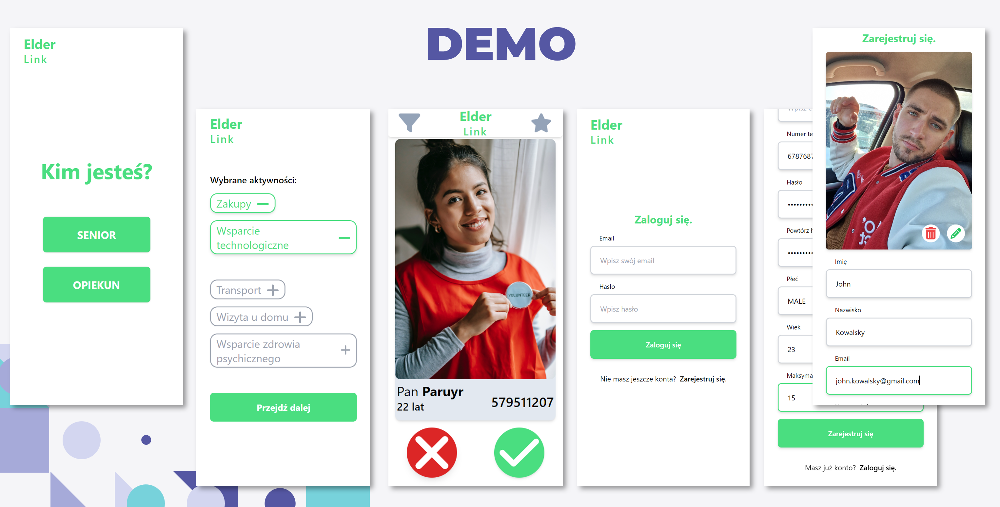

# Elder Link - 6. Bydgoski Hackathon

This web application was developed as part of the 6. Bydgoski Hackathon. The aim of the application is to help senior citizens find service providers based on their activities and location.



## Features
The Elder Link offers the following features:

- [x] Search for service providers based on activity type and location
- [x] View the service providers' profiles, including their contact information and user reviews
- [x] Save service providers to a favorites list for easy access
- [x] Create a profile and add a photo to personalize the user experience

## Setup
From project root run following commands:
```bash
# Initialize containers
$ ./scripts/compose.sh dev up -d

# Rebuild single container
$ ./scripts/compose.sh dev up -d --build --force-recreate --no-deps <service_name>

# Verify running containers
$ ./scripts/compose.sh dev ps

# Stop containers
$ ./scripts/compose.sh dev stop
```

## Authors
- Michał Pstrąg ([@micpst](https://github.com/micpst))
- Patryk Sztuczka ([@patrszyksztuczka](https://github.com/patryksztuczka))
- Szymon Witkowski ([@smigi33](https://github.com/Smigi33))
- Paruyr Gevorgyan ([@paruyrgevorgyan](https://github.com/ParuyrGevorgyan))

## License
This project is licensed under the MIT License - see the LICENSE.md file for details.
